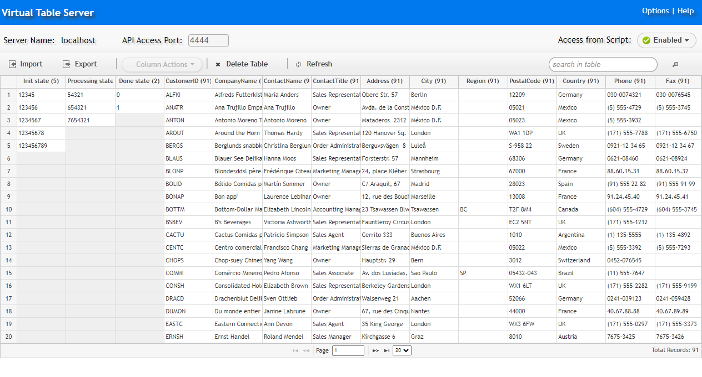

# VTS_from_Jmeter
Integrating VTS With JMeter

What is VTS ?
This is a place where you can store your variables.

It is convenient to use it to exchange data between scripts or even between tests. For example, if you are testing a banking application, you can generate accounts in one test today (and put them in VTS during the test) and tomorrow, in another test, you can use these accounts for any actions.
Or you can put there unique variables that need to be processed, and then take them away - and you will be sure that each variable has been processed only once.

VTS is a free tool that was made for LoadRunner, but it has an HTTP API, which means it can be used with other load testing tools that do not have such a convenient data warehouse.

VTS is a table (or several tables) where you can add rows, take rows (with or without deletion). You can work both with the whole row and with individual columns.
VTS is good because it has a GUI that makes it easy to understand what is in the repository - and thus understand whether you are ready for the next test.

How to use it:
1) Download and Install VTS:
Latest version here (free, registratation required)
https://www.microfocus.com/marketplace/appdelivery/content/virtual-table-server
or here:
https://disk.yandex.ru/d/7NPAbQv1226sSA

2) After installation, you need to enable API access:
open "http://localhost:4000/", switch "Disable" to "Enable" in the "Access from Script" menu.

3) Add the columns and data (you can do this manually, or upload the CSV files or from command line or via the API)

4) Add the http requests from my example to get the data from VTS and use them inside the Jmeter

List of the ALL VTS functions available here:
https://admhelp.microfocus.com/vugen/en/2023-2023-r1/help/function_reference/Content/FuncRef/VTS/etc/lrFr_lrvtc_Functions.htm

But this is the list of DSL-functions that are ONLY available in Virtual User Generator 
(https://www.microfocus.com/marketplace/appdelivery/content/virtual-user-generator-vugen).

In fact, all these functions can be called via HTTP. I added most used calls to my example.
To figure out how to call functions that I didn't added to my example, you need to install Virtual User Generator, add this function to Vugen script and run the script via the proxy server to see the HTTP API.

To get any data from VTS at first you need to do handshake (one time per thread) and after that call other requests to get and put any data to/from VTS. 
